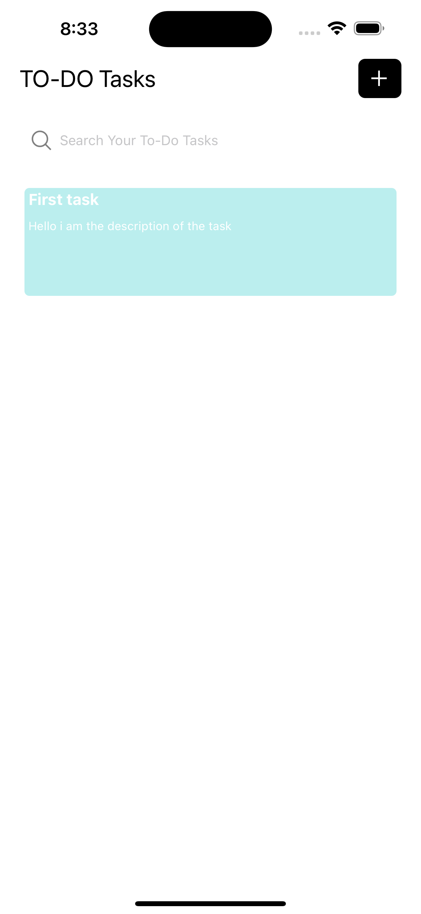
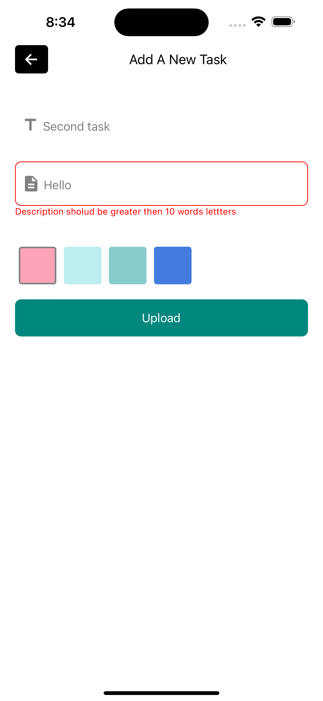
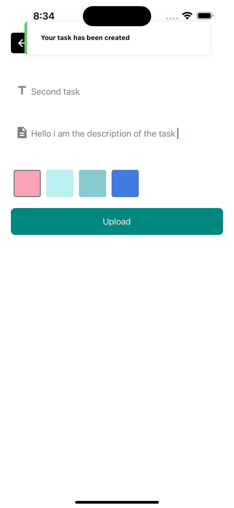
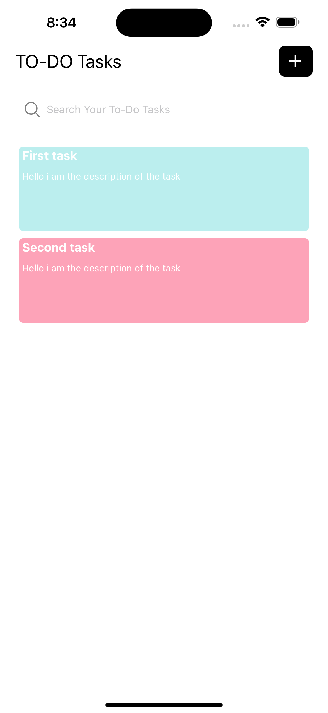

# React Native Todo App

## Overview

This is a simple Todo application built using React Native, with local storage powered by SQLite. The application allows users to create, delete, and filter tasks. Each task can be associated with a specific color for better organization.

## ScreenShots

Home page of the app
  

---

one item in the task list
  

---

Adding new task screen and validate the length of description
  

---

After click upload and the toast shown
  

---

multi items in the task list and filter them by search
  

## Features

### 1. Task Creation

- Users can easily create new tasks by entering task details in the input field.
- The application supports the assignment of colors to tasks for better categorization.

### 2. Local Storage with SQLite

- The application utilizes SQLite for local storage, allowing tasks to be saved locally on the user's device.
- This ensures that tasks persist even when the user closes or reopens the application.

### 3. Task Deletion

- Users can delete tasks that are no longer needed, helping to keep their task list organized.

### 4. Search and Filter

- The application includes a search functionality that enables users to filter tasks based on keywords.
- Users can also filter tasks by color, making it easier to find specific types of tasks.

## Getting Started

### Prerequisites

- React Native development environment set up

### Installation

1. Clone the repository: `git clone https://github.com/yourusername/todo-app.git`
3. Install dependencies: `npm install`
4. Run the application: `npx react-native run-android` or `npx react-native run-ios`

## Usage

1. Open the application on your device or emulator.
2. Create tasks by entering task details and selecting a color.
3. Delete tasks by swiping left or using the delete option.
4. Use the search bar to filter tasks based on keywords.
5. Apply color filters to narrow down your task list.

## Contributing

Contributions are welcome! If you find any issues or have suggestions for improvements, please open an issue or submit a pull request.
